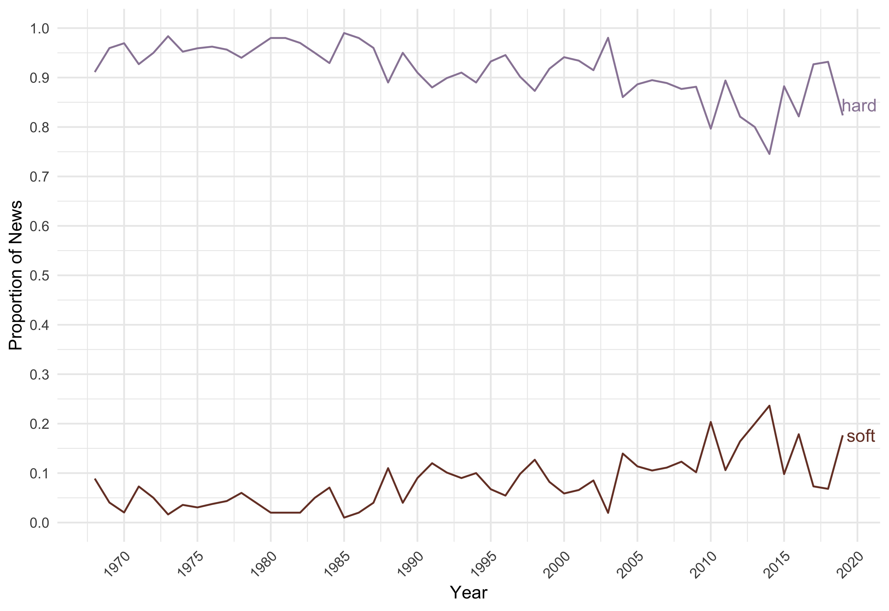

## Hard News: The Softening of Network Television News

Network television news is among the most frequently consumed news in the country. But there is little data on what is covered on network news. Or how the quality of network news has fared over the years. We exploit the Vanderbilt Television News Archive, the largest publicly available database of TV news, to learn about two important aspects of the production of news: geographic focus and political content. Using data from a random sample of over 5,000 broadcast segments spanning 1968--2019, we find that the percentage of network television news devoted to topics unrelated to politics steadily increased from less than 5% in 1968 to over 10% in the last 15 years. The pattern of change in geographic focus is more complex, but there is a clear rise in the percentage of local news over the last two decades. The percentage of local news increased from about 5% in 2000 to over 25% in 2019.

### Data

* [Vanderbilt Broadcast TV News Archives](https://github.com/notnews/vandy_tv_news_abstracts)
* [Coding instrument](data/coding_instrument.docx)
* [Sample](data/sample_questions.csv)
* [Screenshots](data/screenshots/)
* [Gold standard coding](data/sample_questions_gold.csv)
* [Final data](data/final_data.csv)

### Scripts

* [Clean scraped data](scripts/01_clean_vandy.R)

* [Create Sample](scripts/02_sample_f8.R)
    - Stratified random sample by year
    - Weighted random sample by duration of the news segment

* [Recode Data](scripts/03_recode.R)

* [Assess Reliability and Quality of Data](scripts/04_quality_checks.R)

* [Summary statistics on full data set](scripts/05_data_description.R)

* [Coverage of soft news, by channel, by year, by weekday/weekend](scripts/06_soft.R)

* [Coverage of local, national, and foreign, by channel, by year, month, ](scripts/07_geo.R)

* [Coverage of topics in agg., by channel, year, etc.](scripts/08_topics.R)

* [Regression models](scripts/09_regression.R)

### Figures and Tables

* [Figures](figs/)
* [Tables](tabs/)

### Manuscript

* [PDF](ms/us_news.pdf)
* [.tex](ms/us_news.tex)
* [.bib](ms/us_news.bib)

### Authors

Gaurav Sood and Daniel Weitzel
